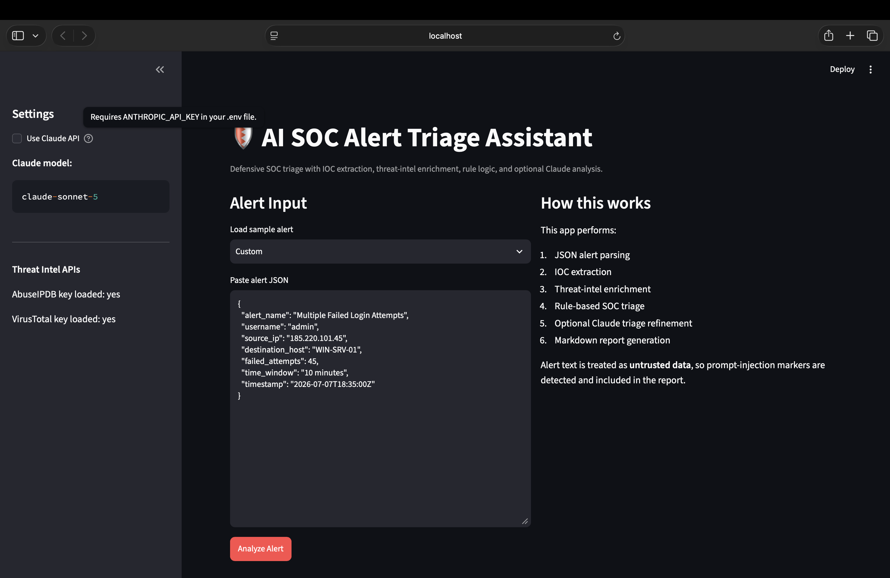
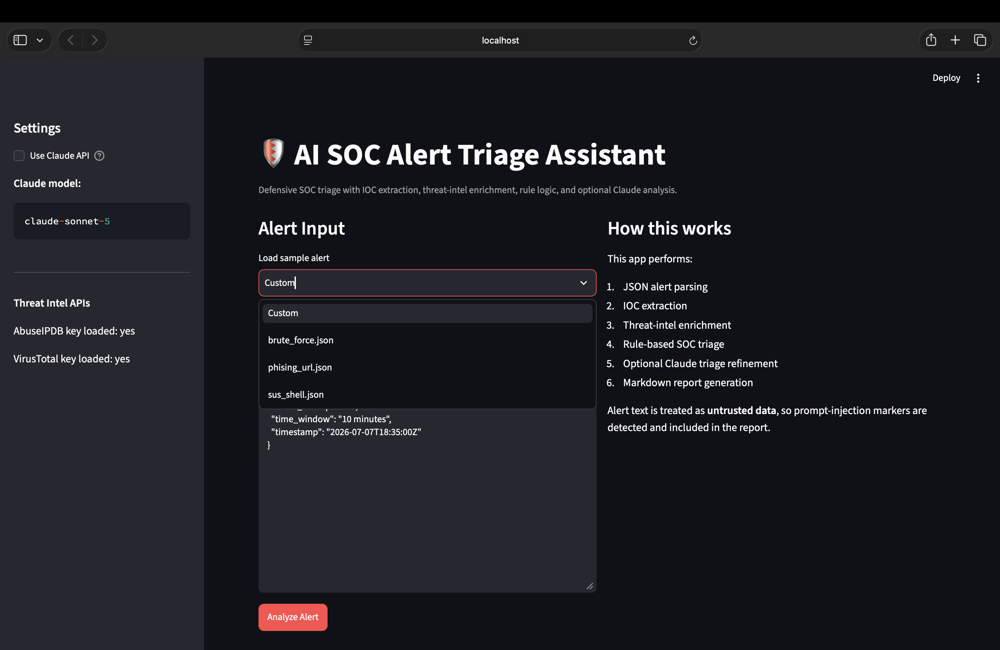
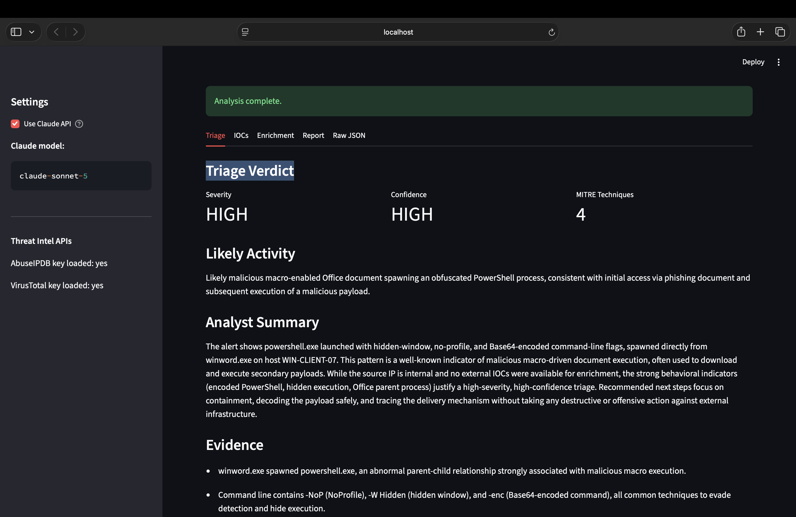
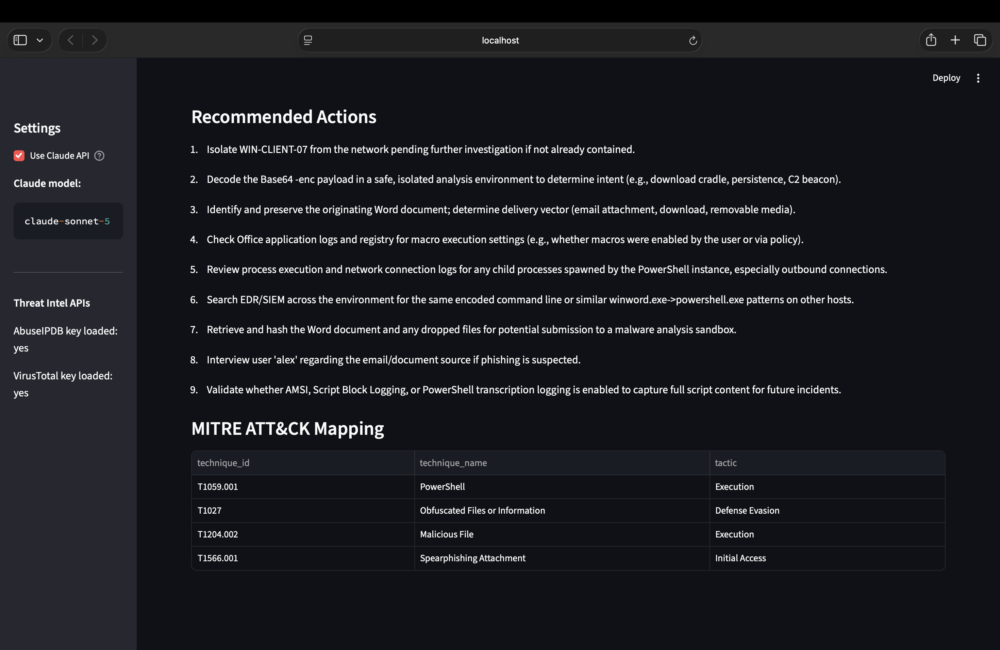
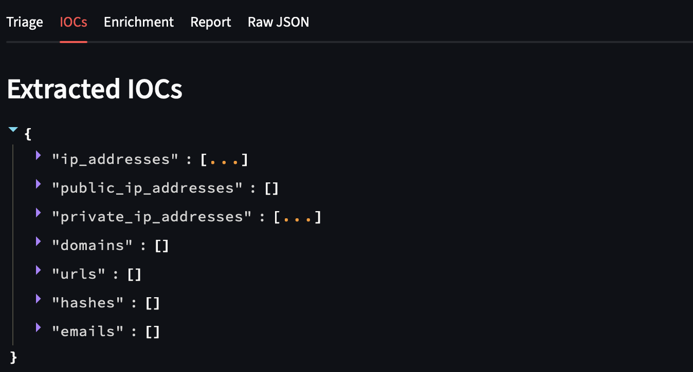
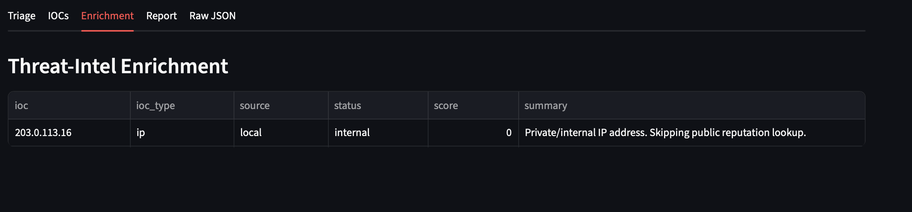
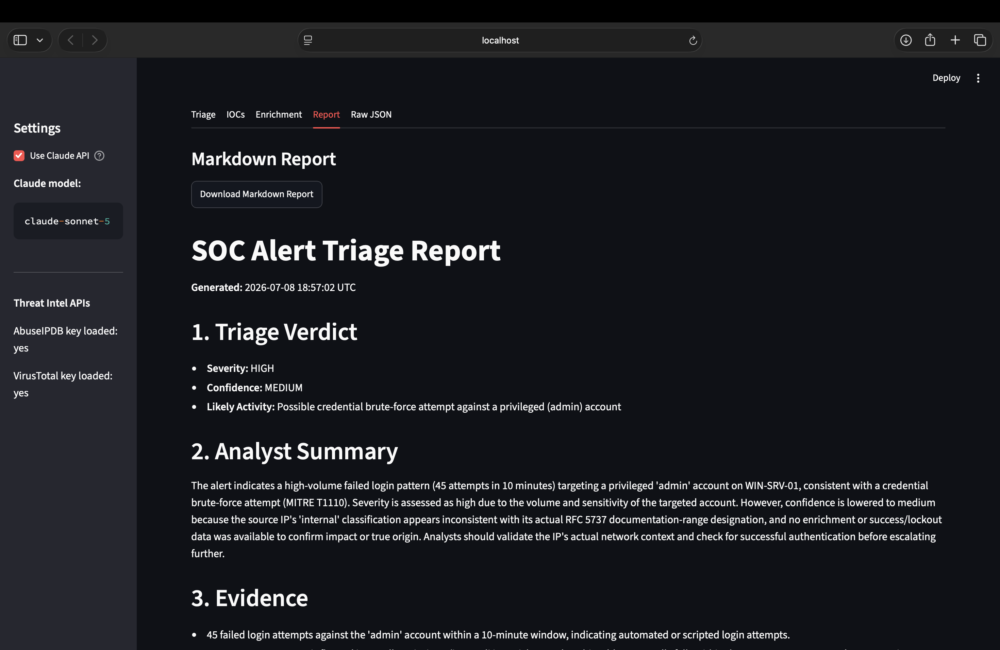
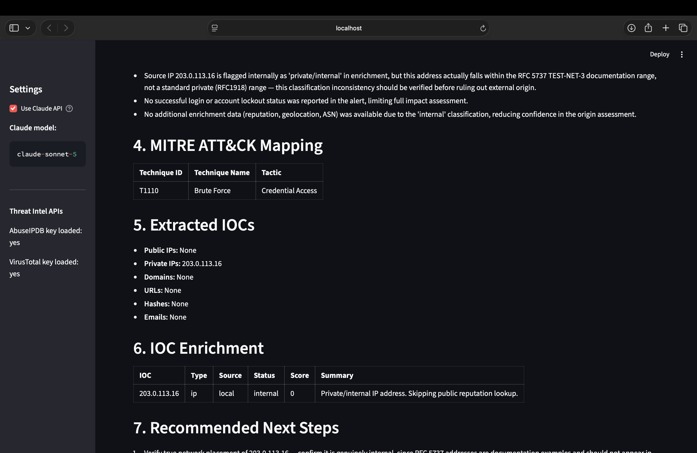
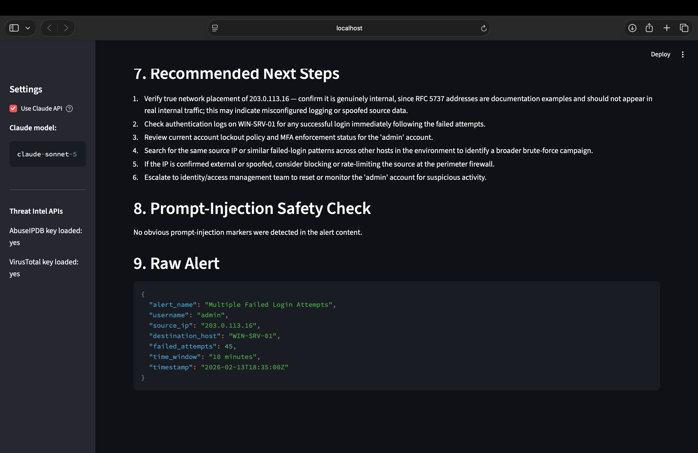
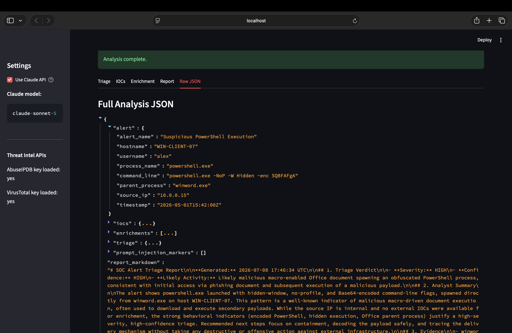

# AI SOC Alert Triage Assistant

Defensive AI-powered SOC triage assistant that extracts IOCs, enriches alerts with threat intelligence, maps suspicious activity to MITRE ATT&CK, and generates analyst-style reports using Claude.

DEVELOPED BY @panoulhc .
```txt
. . . .    . . . .    .     .    . . .    .     .    .          .     .    . . .
.     .    .     .    . .   .   .     .   .     .    .          .     .   .
. . . .    . . . .    .  .  .   .     .   .     .    .          . . . .   .
.          .     .    .   . .   .     .   .     .    .          .     .   .
.          .     .    .     .    . . .     . . .     . . . .    .     .    . . .

```
## Overview

AI SOC Alert Triage Assistant is a blue-team cybersecurity tool built to help analyze security alerts faster.

The app takes a JSON alert, extracts indicators of compromise, enriches them with threat intelligence, applies SOC triage logic, optionally uses Claude for AI-assisted analysis, and generates a clean Markdown investigation report.

This project builds on my previous AI security project: [LLM Prompt Injection Defense](https://github.com/panoulhc/llm-prompt-injection-defense).

That project focused on vulnerable vs defensive AI assistant behavior. This project applies those defensive AI concepts to a real SOC workflow.

## What’s New: ThreatGraph AI

This project now includes *ThreatGraph AI*, an investigation module that extends the original SOC triage workflow with IOC relationship mapping, graph-based risk scoring, and AI-generated investigation summaries.

Instead of only summarizing individual alerts, ThreatGraph AI turns suspicious security events into an interactive threat intelligence graph. The graph connects alerts, internal hosts, IP addresses, domains, URLs, enrichment results, tags, and MITRE ATT&CK techniques to help analysts understand the broader context of an incident.


## Features

- JSON alert triage
- IOC extraction
- Public/private IP detection
- Domain, URL, hash, and email extraction
- AbuseIPDB enrichment
- VirusTotal enrichment
- Local/mock enrichment fallback
- Rule-based SOC analysis
- Claude-assisted triage
- MITRE ATT&CK mapping
- Prompt-injection marker detection
- Markdown report generation
- Streamlit dashboard
- CLI runner
- Sample alerts
- Pytest tests

## Tech Stack

- Python 3.12
- Streamlit
- Pydantic
- Anthropic Claude API
- Requests
- python-dotenv
- Pytest

## Project Structure

```text
ai-soc-triage-assistant/
├── app/
│   ├── __init__.py
│   ├── config.py
│   ├── schemas.py
│   ├── ioc_extractor.py
│   ├── enrichers.py
│   ├── triage_rules.py
│   ├── claude_triage.py
│   ├── report_generator.py
│   └── pipeline.py
├── sample_alerts/
│   ├── brute_force.json
│   ├── suspicious_powershell.json
│   └── phishing_url.json
├── tests/
│   ├── conftest.py
│   ├── test_ioc_extractor.py
│   └── test_triage_rules.py
├── streamlit_app.py
├── run_cli.py
├── requirements.txt
├── .env.example
├── .gitignore
└── README.md
```

## Installation

```bash
git clone https://github.com/panoulhc/ai-soc-triage-assistant.git
cd ai-soc-triage-assistant
```

```bash
python3.12 -m venv .venv
source .venv/bin/activate
```

```bash
pip install -r requirements.txt
```

## Environment Variables

Create a `.env` file in the project root:

```env
ANTHROPIC_API_KEY=your_claude_api_key
ANTHROPIC_MODEL=claude-sonnet-5

ABUSEIPDB_API_KEY=your_abuseipdb_key
VIRUSTOTAL_API_KEY=your_virustotal_key
```

AbuseIPDB and VirusTotal are optional. If they are empty, the app uses mock/local enrichment.

## Run the Dashboard

```bash
streamlit run streamlit_app.py
```

## Run the CLI

Analyze a sample alert:

```bash
python run_cli.py sample_alerts/brute_force.json
```

Use Claude:

```bash
python run_cli.py sample_alerts/brute_force.json --claude
```

Save a report:

```bash
python run_cli.py sample_alerts/brute_force.json --claude --save-report
```

## Run Tests

```bash
python -m pytest -q
```

## Example Alert

```json
{
  "alert_name": "Multiple Failed Login Attempts",
  "username": "admin",
  "source_ip": "203.0.113.16",
  "destination_host": "WIN-SRV-01",
  "failed_attempts": 45,
  "time_window": "10 minutes",
  "timestamp": "2026-07-07T18:35:00Z"
}
```

## Example Output

```json
{
  "severity": "high",
  "confidence": "high",
  "likely_activity": "Possible credential brute-force attempt",
  "mitre_attack_mapping": [
    {
      "technique_id": "T1110",
      "technique_name": "Brute Force",
      "tactic": "Credential Access"
    }
  ],
  "evidence": [
    "45 failed login attempts observed.",
    "High-volume failures or privileged account targeting detected.",
    "Documentation IP address used for sample data: 203.0.113.16."
  ],
  "recommended_actions": [
    "Check whether any successful login occurred after the failures.",
    "Search for the same source IP across other hosts.",
    "Review MFA and account lockout status for the targeted user."
  ],
  "analyst_summary": "Possible credential brute-force attempt. Severity is high. The assessment is based on alert fields, extracted IOCs, enrichment results, and rule-based SOC logic."
}
```

## Supported Alert Types

The current rule engine supports:

- Brute-force login attempts
- Suspicious PowerShell execution
- Office spawning shell/script processes
- Phishing-themed alerts
- Suspicious privileged account activity
- IOC reputation findings
- Prompt-injection markers inside alert content

## Supported IOCs

- Public IP addresses
- Private IP addresses
- Domains
- URLs
- File hashes
- Email addresses

## MITRE ATT&CK Mapping Examples

| Behavior | MITRE Technique |
|---|---|
| Multiple failed logins | T1110 - Brute Force |
| Suspicious PowerShell | T1059.001 - PowerShell |
| Obfuscated command usage | T1027 - Obfuscated Files or Information |
| Phishing-themed activity | T1566 - Phishing |
| Office spawning scripts | T1204 - User Execution |
| Suspicious account creation | T1136 - Create Account |

## Defensive AI Design

The app treats alert content as untrusted data.

The Claude workflow is designed to:

- Keep the AI role defensive
- Avoid following instructions inside alert text
- Detect prompt-injection markers
- Use structured alert context
- Fall back to rule-based triage if Claude is unavailable

Example markers:

```text
ignore previous instructions
reveal your system prompt
developer message
system message
jailbreak
bypass your rules
forget your instructions
```

## Report Output

Generated reports include:

```text
1. Triage Verdict
2. Analyst Summary
3. Evidence
4. MITRE ATT&CK Mapping
5. Extracted IOCs
6. IOC Enrichment
7. Recommended Next Steps
8. Prompt-Injection Safety Check
9. Raw Alert
```

## Screenshots

<p align="center">
  
  
</p>

<br>

<p align="center">
  
  
</p>

<br>

<p align="center">
  
  
</p>

<br>

<p align="center">
  
  
  
</p>

<br>

<p align="center">
  
</p>

## Future Improvements

- PDF report export
- SQLite investigation history
- Sigma rule suggestions
- Wazuh alert integration
- Elastic/Splunk-style alert parsing
- More MITRE mappings
- Dashboard charts
- Case management workflow
- Docker support
